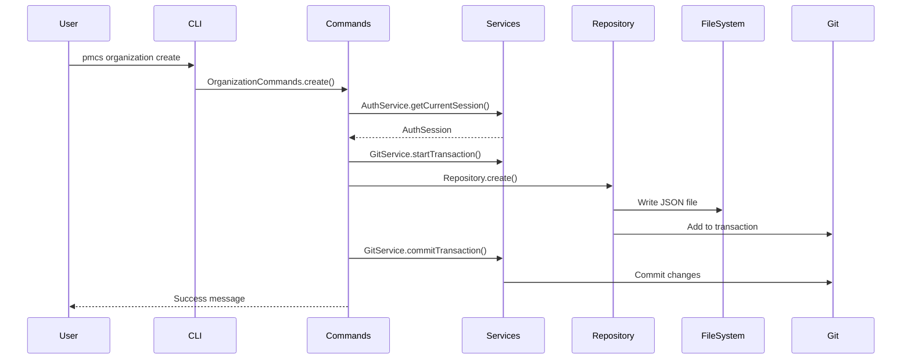
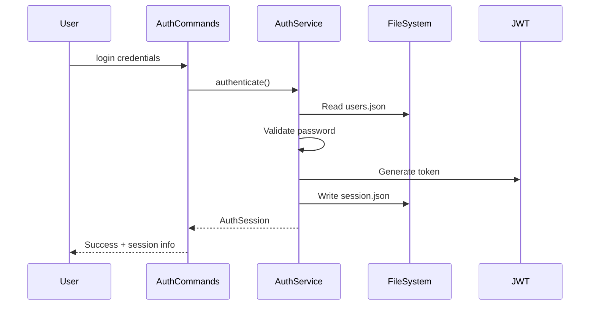
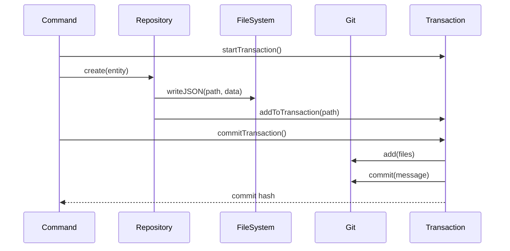

# PMCS Terminal - Architecture Documentation

Technical architecture overview of the PMCS Terminal Application design, patterns, and implementation decisions.

## Table of Contents

- [System Overview](#system-overview)
- [Architectural Principles](#architectural-principles)
- [Layer Architecture](#layer-architecture)
- [Data Flow](#data-flow)
- [File System Design](#file-system-design)
- [Git Integration](#git-integration)
- [Security Architecture](#security-architecture)
- [Scalability Considerations](#scalability-considerations)
- [Performance Optimization](#performance-optimization)

## System Overview

The PMCS Terminal Application is a headless, file-based project management system designed for terminal-driven workflows with enterprise-grade security and git-based collaboration.

### Key Architectural Decisions

1. **File-Based Storage** - No database dependency, all data in JSON files
2. **Git-Native** - Version control as a first-class citizen
3. **CLI-First** - Terminal interface with structured commands
4. **Corporate Hierarchy** - Built-in organizational structure support
5. **Transaction Safety** - Atomic operations via git transactions
6. **TypeScript** - Strong typing for maintainability
7. **Modular Design** - Loosely coupled components

### Technology Stack

```
┌─────────────────────────────────────────┐
│           User Interface                │
├─────────────────────────────────────────┤
│ Commander.js │ Chalk │ CLI-Table3       │ ← CLI Layer
├─────────────────────────────────────────┤
│ TypeScript │ Node.js │ Inquirer         │ ← Runtime
├─────────────────────────────────────────┤
│ JWT │ BCrypt │ Zod │ Simple-Git        │ ← Core Libraries
├─────────────────────────────────────────┤
│ JSON Files │ Git Repository            │ ← Data Layer
├─────────────────────────────────────────┤
│ File System │ Operating System         │ ← System Layer
└─────────────────────────────────────────┘
```

## Architectural Principles

### 1. Single Responsibility Principle
Each class and module has one clear purpose:
- **AuthenticationService** - Only handles authentication
- **GitService** - Only handles git operations
- **FileBasedRepository** - Only handles data persistence
- **Commands** - Only handle CLI interactions

### 2. Dependency Injection  
Dependencies are injected through constructors, enabling:
- Easy testing with mocks
- Flexible configuration
- Loose coupling between components

```typescript
class OrganizationCommands {
  constructor(
    private authService: AuthenticationService,    // Injected
    private repository: Repository<Organization>,  // Injected
    private gitService: GitService                 // Injected
  ) {}
}
```

### 3. Repository Pattern
Abstract data access layer that:
- Hides storage implementation details
- Provides consistent CRUD interface
- Enables easy switching between storage backends
- Supports query patterns

### 4. Command Pattern
CLI commands are encapsulated as classes:
- Consistent command structure
- Easy to test and extend
- Clear separation of concerns
- Reusable command logic

### 5. Transaction Pattern
Git-based transactions ensure:
- Atomic operations (all-or-nothing)
- Rollback capability on errors
- Consistent state management
- Audit trail for all changes

## Layer Architecture

### 1. CLI Layer
**Purpose**: Handle user interactions and command parsing
**Components**:
- `cli.ts` - Main application entry point
- Command classes (`AuthCommands`, `OrganizationCommands`, etc.)
- `HelpSystem` - Documentation and usage information

**Responsibilities**:
- Parse command-line arguments
- Validate user input
- Format output for display
- Handle errors gracefully

```typescript
// CLI Layer Example
export class AuthCommands {
  async login(options: LoginOptions): Promise<void> {
    try {
      // 1. Validate input
      // 2. Call service layer
      // 3. Format response
      // 4. Handle errors
    } catch (error: any) {
      console.error(chalk.red(`❌ ${error.message}`));
      process.exit(1);
    }
  }
}
```

### 2. Service Layer
**Purpose**: Business logic and orchestration
**Components**:
- `AuthenticationService` - User authentication and sessions
- `GitService` - Git operations and transactions
- `RepositoryFactory` - Repository creation and management

**Responsibilities**:
- Implement business rules
- Coordinate between components
- Manage transactions
- Enforce security policies

```typescript
// Service Layer Example
export class AuthenticationService {
  async authenticate(credentials: LoginCredentials): Promise<AuthSession> {
    // 1. Validate credentials
    // 2. Check permissions
    // 3. Create session
    // 4. Return session with context
  }
}
```

### 3. Repository Layer
**Purpose**: Data access abstraction
**Components**:
- `Repository<T>` interface
- `FileBasedRepository<T>` implementation
- Entity-specific repositories

**Responsibilities**:
- CRUD operations
- Query capabilities
- Data validation
- Storage abstraction

```typescript
// Repository Layer Example
export class FileBasedRepository<T extends BaseEntity> {
  async create(entityData: Omit<T, 'id' | 'createdAt' | 'updatedAt'>): Promise<T> {
    // 1. Generate ID
    // 2. Add timestamps
    // 3. Write to file
    // 4. Add to git transaction
  }
}
```

### 4. Storage Layer
**Purpose**: Physical data persistence
**Components**:
- JSON files for entity storage
- Git repository for version control
- File system operations

**Responsibilities**:
- File I/O operations
- Directory structure management
- Git repository management
- Backup and recovery

## Data Flow

### 1. Command Execution Flow



### 2. Authentication Flow



### 3. Data Persistence Flow



## File System Design

### Directory Structure

```
project-root/
├── .git/                           # Git repository
├── .pmcs/                          # Application configuration
│   ├── config.json                 # App settings
│   ├── users.json                  # User accounts
│   ├── session.json                # Current session
│   └── logs/                       # Application logs
│       └── application.log
├── organizations/                  # Organization entities
│   ├── org-abc123.json            # Organization metadata
│   └── org-def456.json
├── assignments/                    # Assignment entities
│   ├── assignment-123.json
│   └── assignment-456.json
├── announcements/                  # Announcement entities
│   ├── announcement-789.json
│   └── announcement-012.json
└── entities/                       # Hierarchical entity storage
    └── organizations/
        └── org-abc123/
            ├── organization.json   # Org metadata
            ├── portfolios/         # Child portfolios
            ├── programs/           # Child programs
            ├── projects/           # Child projects
            ├── assignments/        # Org assignments
            ├── announcements/      # Org announcements
            └── README.md           # Auto-generated docs
```

### File Format Standards

**Entity Files (JSON)**
```json
{
  "id": "clh7x9k2l0000zjcq5z1b8q9f",
  "name": "Strategic Initiatives",
  "description": "Main strategic projects",
  "corporateLevel": "ORGANIZATION",
  "settings": {
    "classification": "UNCLASSIFIED",
    "requiresApproval": false,
    "defaultAccessLevel": "OBSERVER"
  },
  "createdAt": "2024-07-29T14:30:45.123Z",
  "updatedAt": "2024-07-29T14:30:45.123Z",
  "createdBy": "admin-user",
  "version": "1.0.0",
  "entityType": "organization",
  "lastModified": "2024-07-29T14:30:45.123Z"
}
```

**Configuration Files**
```json
// .pmcs/config.json
{
  "application": {
    "name": "PMCS Terminal",
    "version": "1.0.0", 
    "sessionTimeout": 28800,
    "defaultClassification": "UNCLASSIFIED"
  },
  "git": {
    "autoCommit": true,
    "requireSignedCommits": false,
    "defaultBranch": "main"
  },
  "corporate": {
    "enforceHierarchy": true,
    "requireApprovals": false,
    "defaultAccessLevel": "MEMBER"
  }
}
```

### Storage Strategy

**Hybrid Approach**: Combines flat files with hierarchical structure
- **Flat storage** for global entity queries and indexing
- **Hierarchical storage** for entity relationships and organization
- **Dual indexing** for performance and relationship management

**Benefits**:
- Fast global queries (flat structure)
- Clear entity relationships (hierarchical structure)
- Git-friendly (small, focused commits)
- Human-readable (JSON format)

## Git Integration

### Transaction System

**Atomic Operations**: All file changes within a command are treated as a single transaction

```typescript
// Transaction Lifecycle
1. startTransaction()     // Initialize transaction state
2. addToTransaction()     // Track files to commit
3. commitTransaction()    // Atomic commit or rollback
```

**Transaction States**:
- **INACTIVE** - No transaction in progress
- **ACTIVE** - Files being tracked for commit
- **COMMITTING** - Performing git operations
- **ROLLINGBACK** - Undoing changes due to error

### Commit Strategy

**Structured Commit Messages**:
```
<type>: <subject>

<body>

🔒 Classification: <level>
👤 Author: <name> [<corporate-level>]
🏢 Entity: <entity-type>/<entity-id>
⏰ Timestamp: <iso-date>

🤖 Generated with PMCS Terminal Application
```

**Commit Types**:
- `feat:` - New entity creation
- `update:` - Entity modifications  
- `delete:` - Entity removal
- `config:` - Configuration changes
- `admin:` - Administrative operations

### Branch Strategy

**Single Branch Default**: Uses `main` branch for simplicity
**Future Extensions**: Support for feature branches and pull request workflows

```typescript
// Future branch strategy
interface BranchStrategy {
  main: string;           // Production branch
  develop: string;        // Development branch  
  feature(name: string): string;  // Feature branches
  hotfix(name: string): string;   // Hotfix branches
}
```

## Security Architecture

### Authentication & Authorization

**Multi-Layer Security**:
1. **Authentication** - JWT tokens with configurable expiration
2. **Authorization** - Role-based permissions  
3. **Corporate Hierarchy** - Organizational access control
4. **Classification** - Security level restrictions

```typescript
// Security Stack
Authentication (JWT) 
    ↓
Session Management
    ↓
Role-Based Permissions
    ↓
Corporate Hierarchy
    ↓
Classification Levels
    ↓
Entity Access Control
```

### Data Security

**At Rest**:
- JSON files with appropriate permissions
- Sensitive data (passwords) hashed with bcrypt
- Session tokens with expiration
- Classification-based access control

**In Transit**:
- Local file system operations
- No network communication in base implementation
- Future: HTTPS for remote git repositories

**Audit Trail**:
- All operations logged via git commits
- User attribution in commit messages
- Timestamp and context information
- Full history preservation

### Permission Model

```typescript
// Hierarchical Permission System
interface PermissionModel {
  corporateLevel: CorporateLevel;     // User's position in hierarchy
  classification: Classification;      // Security clearance level
  entityPermissions: {                // Specific entity access
    [entityId: string]: AccessLevel;
  };
  systemPermissions: string[];        // System-wide permissions
}

// Access Decision
function hasAccess(
  user: User, 
  entity: Entity, 
  operation: Operation
): boolean {
  return (
    checkCorporateHierarchy(user.corporateLevel, entity.corporateLevel) &&
    checkClassification(user.classification, entity.classification) &&
    checkEntityPermissions(user.id, entity.id, operation) &&
    checkSystemPermissions(user.permissions, operation)
  );
}
```

## Scalability Considerations

### File System Scalability

**Current Limits**:
- **Entities**: ~10,000 per type (OS file system limits)
- **Concurrent Users**: Limited by file locking
- **Repository Size**: Git performance degrades with large repos

**Scaling Strategies**:

1. **Horizontal Partitioning**
   ```
   organizations/
   ├── shard-0/     # Organizations 0-999
   ├── shard-1/     # Organizations 1000-1999
   └── shard-n/     # Organizations n*1000 to (n+1)*1000
   ```

2. **Time-Based Partitioning**
   ```
   assignments/
   ├── 2024/
   │   ├── 01/      # January assignments
   │   └── 02/      # February assignments
   └── 2025/
   ```

3. **Hierarchical Scaling**
   - Separate repositories per organization
   - Git submodules for large organizations
   - Distributed git workflows

### Performance Optimization

**Caching Strategy**:
```typescript
interface CacheLayer {
  entities: LRUCache<string, Entity>;      // Recently accessed entities
  sessions: LRUCache<string, AuthSession>; // Active sessions
  permissions: LRUCache<string, boolean>;  // Permission checks
}
```

**Indexing Strategy**:
```typescript
// Auto-generated index files
interface EntityIndex {
  [entityId: string]: {
    filePath: string;
    lastModified: Date;
    metadata: EntityMetadata;
  };
}
```

**Lazy Loading**:
- Load entities on-demand
- Paginated list operations
- Streaming for large datasets

### Memory Management

**Memory-Efficient Operations**:
```typescript
// Stream-based processing for large lists
async function* listEntitiesStream<T>(
  directory: string
): AsyncGenerator<T> {
  const files = await fs.readdir(directory);
  
  for (const file of files) {
    if (file.endsWith('.json')) {
      const entity = await fs.readJSON(path.join(directory, file));
      yield entity;
    }
  }
}
```

**Garbage Collection**:
- Automatic cleanup of expired sessions
- Periodic index optimization
- Old commit pruning (configurable)

## Future Architecture Considerations

### Microservices Evolution

**Potential Service Boundaries**:
```
┌─────────────────┐  ┌─────────────────┐  ┌─────────────────┐
│ Authentication  │  │ Entity Manager  │  │ Notification    │
│ Service         │  │ Service         │  │ Service         │
└─────────────────┘  └─────────────────┘  └─────────────────┘
         │                     │                     │
         └─────────────────────┼─────────────────────┘
                               │
                    ┌─────────────────┐
                    │ API Gateway     │
                    │ (CLI Interface) │
                    └─────────────────┘
```

### Database Migration Path

**Phase 1**: File-based (current)
**Phase 2**: Hybrid (files + database for indexing)
**Phase 3**: Database-primary (files for backup/export)

```typescript
// Database abstraction for future migration
interface DataStore {
  entities: Repository<Entity>;
  search: SearchIndex;
  cache: CacheLayer;
  backup: FileBackup;
}
```

### API Layer Addition

**RESTful API Extension**:
```typescript
// Express.js server layer
app.post('/api/organizations', authenticateJWT, createOrganization);
app.get('/api/organizations', authenticateJWT, listOrganizations);
app.get('/api/organizations/:id', authenticateJWT, getOrganization);
```

**GraphQL Alternative**:
```typescript
// GraphQL schema
type Organization {
  id: ID!
  name: String!
  description: String
  corporateLevel: CorporateLevel!
  assignments: [Assignment!]!
  announcements: [Announcement!]!
}
```

---

*This architecture documentation provides the foundation for understanding, maintaining, and extending the PMCS Terminal Application.*